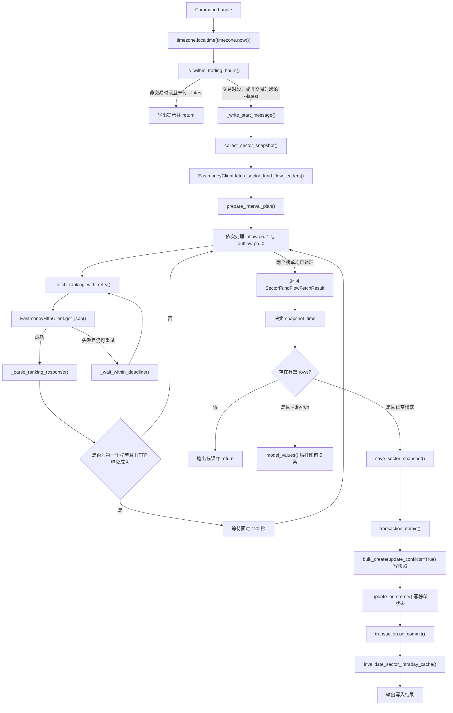
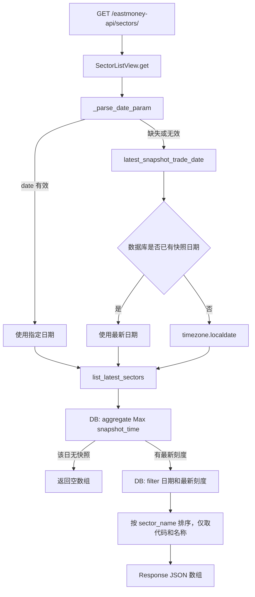
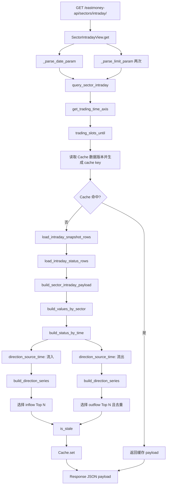

# 板块资金流向监控（东方财富 + 开盘啦）

这是一个 Django + React 单仓库应用，用于定时抓取两套**完全独立**的板块资金流数据源，按 15 分钟交易刻度保存快照，并展示当日资金净流入、净流出走势：

- **东方财富**：三级行业（`fs=m:90+s:8+f:!50`）。
- **开盘啦**：开盘啦 App 自身的 270 个混合行业/概念板块（`ZhiShuRanking.RealRankingInfo`）。

前端通过两个 tab 切换数据源，默认进入东方财富；两套数据源在数据库、Web API、管理命令、服务层和前端 hooks 上均相互独立，仅复用 Django/DRF 框架、`chinese-calendar` 交易日判断，以及 `SectorFlowChart`、`SectorRankingList` 两个纯展示组件。

## 当前功能

- 数据源：东方财富三级行业列表接口 `push2.eastmoney.com/api/qt/clist/get`。
- 行业范围：仅抓取三级行业，筛选为 `fs=m:90+s:8+f:!50`；不保留二级行业或混合板块数据。
- 每轮抓取固定发送两次请求：
  - `fid=f62&po=1&pn=1&pz=50`：主力净流入 Top 50。
  - `fid=f62&po=0&pn=1&pz=50`：主力净流出 Top 50。
- 两次结果按板块代码合并；重复板块使用后发出的流出榜响应数据。
- 在首个榜单请求成功后，发起另一个榜单请求前固定等待 120 秒。每个榜单的初始请求失败后最多重试 5 次；重试间隔在首个请求前随机生成、彼此不同且每次不少于 45 秒。10 个重试间隔与 1 个成功间隔的计划总和不超过 700 秒，并以严格小于 890 秒的单轮抓取硬截止。
- 单个方向失败时保留另一方向的数据并记录该刻度的双榜状态；两个方向都失败时不写数据库。
- 前端一次获取流入、流出各 25 条，图表默认显示两侧各 5 条，可通过复选框增删曲线。
- 前端不使用浏览器缓存，也不自动轮询；重复 API 查询由服务端缓存处理。

## 开盘啦数据源（独立）

- 独立 Django app：`backend/kaipanla/`，路由到独立数据库 `backend/kaipanla.sqlite3`（`kaipanla.db_router.KaipanlaRouter`）。
- 独立 Web API：`/kaipanla-api/sectors/` 与 `/kaipanla-api/sectors/intraday/`。
- 独立管理命令：`python manage.py fetch_kaipanla_sector_fund_flow`。
- 实时端点：`https://apphwshhq.longhuvip.com/w1/api/index.php`，动作 `c=ZhiShuRanking&a=RealRankingInfo`，每页 30 条，串行分页直到 `Index >= Count`。
- 认证凭据从环境变量读取：`KPL_USER_ID`、`KPL_TOKEN`、`KPL_DEVICE_ID`，禁止硬编码。
- 开盘啦只保存上游真实返回的字段，不伪造东财口径的超大/大/中/小单或主力净占比。

## 项目结构

```text
backend/
├── config/                         # Django 配置与路由
└── fundflow/
    ├── management/commands/
    │   └── fetch_sector_fund_flow.py
    ├── migrations/                 # 数据库迁移
    ├── services/
    │   ├── eastmoney/              # 间隔计划、HTTP、解析和双榜请求编排
    │   ├── snapshot_time.py        # 交易时段和快照时间对齐
    │   ├── snapshot_collection.py  # 抓取结果与快照时间组合
    │   ├── snapshot_writer.py      # 原子化写库和提交后缓存失效
    │   ├── sector_intraday_queries.py   # 只读 ORM 查询
    │   ├── sector_intraday_builders.py  # 纯数据聚合与 stale 判断
    │   ├── sector_intraday_service.py   # 缓存和分时查询协调
    │   ├── trading_calendar.py     # 交易日判断
    │   └── trading_time.py         # 15 分钟交易刻度
    ├── models.py                   # 三级行业资金流快照模型
    ├── views.py                    # 薄 DRF API 层
    └── urls.py
frontend/src/
├── api/client.js                   # Axios 客户端
├── components/                     # 图表和排行列表
├── features/sector-flow/           # 页面、数据请求/勾选 hooks、纯曲线 helpers
├── App.jsx                         # 薄应用入口
└── index.css
docs/                               # 文档图片
```

## 数据与时间规则

`EastmoneySectorFundFlowSnapshot` 只保存三级行业的板块代码、名称、指数涨跌、主力及各档资金净流入；`(sector_code, snapshot_time)` 是唯一约束。同一刻度重新抓取时会更新已存在的板块记录。`EastmoneySectorFundFlowSnapshotStatus` 单独记录流入榜、流出榜是否成功，避免部分响应被误判为完整快照。

交易时段为：

- 上午 `09:30–11:30`
- 下午 `13:00–15:00`

每天共 18 个 15 分钟刻度。命令启动时间向下对齐，例如：

- 09:35 → 09:30
- 10:10 → 10:00
- 11:15 → 11:15

交易日使用 `chinese-calendar` 判断，并额外排除周六、周日。交易所临时休市等法定节假日之外的例外需单独维护。

聚合只允许当前刻度实际榜单中的板块参与 Top N。已入选板块缺失中间刻度时使用前一个已知值填充；首次出现前没有历史快照的刻度显示为 0。若当前刻度的流入榜或流出榜请求失败（或没有该方向记录），该方向严格使用上一个 15 分钟刻度的数据，并标记为陈旧。

## 管理命令

在 `backend/` 中运行：

```bash
python manage.py fetch_sector_fund_flow
```

仅在交易时段发请求。非交易时段、周末和法定节假日直接退出，不访问东方财富，也不写数据库。

```bash
python manage.py fetch_sector_fund_flow --latest
```

用于非交易时段初始化或恢复数据。命令优先采用东财 `f124` 行情时间，并对齐到最近合法交易刻度。交易时段内传入 `--latest` 时仍按正常实时抓取处理。

```bash
python manage.py fetch_sector_fund_flow --dry-run
```

执行真实请求并打印前几条清洗结果，但不写数据库。参数可以组合，例如 `--latest --dry-run`。

开盘啦使用独立的命令（同样支持 `--latest` 与 `--dry-run`）：

```bash
python manage.py fetch_kaipanla_sector_fund_flow
python manage.py fetch_kaipanla_sector_fund_flow --latest
python manage.py fetch_kaipanla_sector_fund_flow --dry-run
```

开盘啦 Token 可能过期；命令通过 `KPL_*` 环境变量读取凭据，过期时会在日志中明确报错并中止抓取，不会写入数据。

## API

| 方法 | 路径 | 说明 |
|---|---|---|
| `GET` | `/eastmoney-api/sectors/` | 返回指定日期最近快照中的三级行业列表。 |
| `GET` | `/eastmoney-api/sectors/intraday/` | 返回三级行业分时累计主力净流入曲线。 |
| `GET` | `/kaipanla-api/sectors/` | 返回指定日期最近快照中的开盘啦板块列表。 |
| `GET` | `/kaipanla-api/sectors/intraday/` | 返回开盘啦板块分时累计主力净流入曲线。 |

分时接口参数：

```text
/eastmoney-api/sectors/intraday/?date=2026-08-27&inflow_top=25&outflow_top=25
```

- `date`：可选，格式为 `YYYY-MM-DD`；省略时使用数据库中最近有数据的日期。
- `inflow_top`、`outflow_top`：可选，默认各 5，允许 0，单侧最大 30。
- `stale`：表示标准时间轴缺少快照、当前双榜有任一方向不完整，或任一方向已回退到上一个刻度。

开盘啦接口 `/kaipanla-api/sectors/intraday/` 参数结构一致；其 `stale` 表示时间轴缺少快照、当前刻度抓取失败，或已回退到上一个有数据的刻度。

## 代码执行流程（按函数）

本节以一次实际调用为单位，说明管理命令和两个 Web API 从入口到输出的函数调用链。流程图中的菱形表示条件分支；`DB` 表示数据库读写，`Cache` 表示 Django 服务端缓存。两个 Web API 都只读取数据库，**不会**在 HTTP 请求中访问东方财富。

### 1. `python manage.py fetch_sector_fund_flow`



#### 逐步说明

1. **`Command.handle(*args, **options)`** 是 Django 管理命令入口。它取得当前本地时间 `now_local`，调用 `is_within_trading_hours(now_local)` 判断今天是否为交易日且当前是否落在上午 `09:30–11:30` 或下午 `13:00–15:00`。
2. 若不在交易时段，并且没有传 `--latest`，命令只输出提示后结束；不会请求上游，也不会写库。`--latest` 只有在非交易时段时才会启用“抓取最近可用行情”的模式；交易时段即使传了该参数，仍按普通抓取处理。
3. **`_write_start_message()`** 只负责输出说明。普通模式会展示 `floor_to_15min(now_local)` 计算出的当前 15 分钟写入刻度。
4. **`collect_sector_snapshot(now_local, latest_mode, fetcher)`** 负责将“抓取数据”和“选择快照时间”组合起来，但不写数据库：
   - 调用 `fetcher.fetch_sector_fund_flow_leaders()` 获取两个排行榜的合并结果；
   - 普通模式用 `floor_to_15min()` 向下对齐当前时间；
   - `--latest` 模式用 `latest_snapshot_time_from_source_rows()` 优先解析上游字段 `f124` 的行情时间；无有效时间戳时用 `fallback_latest_snapshot_time()` 推断最近已结束的交易刻度。
5. **`EastmoneyClient.fetch_sector_fund_flow_leaders()`** 是兼容名称，实际使用 `SectorRankingFetcher` 的双榜编排逻辑。开始时先调用 **`prepare_interval_plan()`**，一次性生成全部 10 个重试间隔：它从 `45` 到 `54` 秒中随机排列出 10 个不重复值，并与固定的 120 秒跨榜单间隔组成计划。`validate_interval_plan()` 校验每个重试不少于 45 秒、间隔不重复、总和不超过 700 秒。
6. `SectorRankingFetcher` 建立 `889` 秒的单轮 deadline，按固定顺序处理：先流入榜 `po=1`，再流出榜 `po=0`。**`build_ranking_params(sort_order)`** 将三级行业筛选 `fs=m:90+s:8+f:!50`、`fid=f62`、`pn=1`、`pz=50` 等固定参数组装为单次请求参数。
7. **`_fetch_ranking_with_retry()`** 处理一个方向的请求。它最多执行 6 次 HTTP 尝试：首次尝试加上最多 5 次重试。每次尝试前检查 deadline；失败后如果还有重试机会，取出一个预生成间隔，先用 **`can_wait_until_deadline()`** 判断“完整等待后是否仍在 deadline 内”，只有满足时才通过 **`_wait_within_deadline()`** 调用 `sleep()`。
8. **`EastmoneyHttpClient.get_json(params, timeout)`** 只发送一次 `GET` 请求：取得当前线程的 `requests.Session`，请求东财接口，调用 `raise_for_status()`，再调用 `response.json()`。网络异常和 JSON 异常交给上层重试逻辑处理。若是 `ConnectionError`，`_fetch_ranking_with_retry()` 会调用 **`rebuild_session_after_connection_error()`** 重建自有 Session；外部传入的 Session 不会被关闭。
9. HTTP 成功后，**`_parse_ranking_response()`** 调用 **`extract_ranking_rows()`** 从 `data.diff` 取出列表（也兼容字典格式），逐行调用 **`parse_sector_row()`**：没有行业代码 `f12` 或主力净流入 `f62` 的行会被丢弃，其余字段会被转换为应用内部的行业字典。以 `sector_code` 为键放入 `rows_by_code`，因此后处理的流出榜会覆盖同代码的流入榜记录。
10. 第一个榜单只要得到非 `None` 的 HTTP/JSON 响应（即使排行榜为空），便调用 **`_wait_for_successful_ranking(120, deadline)`**。它不会缩短 120 秒：如果完整等待会超出 deadline，则结束后续榜单请求；否则固定等待 120 秒，再处理流出榜。
11. 两个方向处理完后，函数返回 **`SectorFundFlowFetchResult`**，其中包含合并后的 `rows`，以及 `inflow_succeeded` / `outflow_succeeded` 两个“是否有有效解析行”的状态。单边失败时仍会保留另一边的数据。
12. 回到 `Command.handle()`：若 `rows` 为空，说明两个方向都失败、为空或均被清洗丢弃，命令报错并返回。若是 `--dry-run`，**`model_values()`** 会移除只用于时间推断的 `source_timestamp` 后打印前五条，绝不写库。
13. 正常模式调用 **`save_sector_snapshot(snapshot_time, fetch_result)`**。该函数在 **`transaction.atomic()`** 中执行两类写入：
    - 用 `bulk_create(..., update_conflicts=True)` 按唯一键 `(sector_code, snapshot_time)` 插入或更新所有快照行；
    - 用 `EastmoneySectorFundFlowSnapshotStatus.objects.update_or_create()` 写入同一刻度的流入／流出是否成功状态。
14. 事务成功提交后才执行 `transaction.on_commit()` 注册的 **`invalidate_sector_intraday_cache(trade_date)`**。因此事务回滚时不会错误清理缓存；成功时后续 API 会使用新的数据版本重新聚合。

### 2. `GET /eastmoney-api/sectors/`

该接口用于返回某个交易日**最后一个已有快照**里的三级行业代码和名称，适合下拉框或行业列表。默认路由是 `config.urls` 的 `path("api/", include("fundflow.urls"))` 加上 `fundflow.urls` 的 `path("sectors/", ...)`。



#### 逐步说明

1. Django URL 路由将请求交给 **`SectorListView.get(request)`**。
2. **`_parse_date_param(request)`** 读取可选的 `date` 参数，并用 `datetime.date.fromisoformat()` 解析 `YYYY-MM-DD`。格式正确时直接使用该日期。
3. 日期缺失或格式无效时，`_parse_date_param()` 调用 **`latest_snapshot_trade_date()`**，用 ORM 的 `aggregate(Max("trade_date"))` 找数据库中最近有快照的交易日；若数据库完全没有快照，才回退到 `timezone.localdate()`。
4. **`list_latest_sectors(trade_date)`** 先在该交易日调用 `aggregate(Max("snapshot_time"))` 找最新已写入的快照刻度。没有数据时返回 `[]`。
5. 找到刻度后，函数筛选该日、该刻度的 `EastmoneySectorFundFlowSnapshot`，按行业名称排序，只查询 `sector_code` 与 `sector_name` 两个字段，最后转换为稳定的 `[{"code": "...", "name": "..."}]` 数组。
6. `Response(...)` 将数组序列化为 JSON。这个接口不读取缓存、不做聚合、不产生任何上游请求。

### 3. `GET /eastmoney-api/sectors/intraday/`

该接口返回图表需要的三级行业分时累计主力净流入曲线。例如：

```text
/eastmoney-api/sectors/intraday/?date=2026-08-27&inflow_top=25&outflow_top=25
```



#### 逐步说明

1. Django 将路由交给 **`SectorIntradayView.get(request)`**。该方法先复用 **`_parse_date_param()`** 选择交易日，规则与 `/eastmoney-api/sectors/` 相同。
2. 接着对 `inflow_top` 和 `outflow_top` 分别调用 **`_parse_limit_param()`**。它会将输入转为整数，无效输入回退到默认值 `5`，并限制在 `0–30`；因此可以传 `0` 表示不返回某一侧。
3. **`query_sector_intraday(trade_date, inflow_top, outflow_top)`** 是查询用例的协调函数。它首先通过 **`get_trading_time_axis()`** 调用 **`trading_slots_until()`**：
   - 查询过去的交易日时返回该日完整 18 个标准刻度；
   - 查询当天时只返回当前时刻已经到达的刻度；
   - 查询未来日期时返回空时间轴。
4. 查询函数读取该交易日的缓存版本键，并用日期、时间轴、版本号、两个 Top N 参数调用 `sector_intraday_cache_key()` 生成缓存键。版本号会在抓取命令成功提交后变化，因此旧缓存自然失效。
5. 缓存命中时，`cache.get()` 返回已完成的 payload，函数立即结束，不访问数据库。
6. 缓存未命中时，**`load_intraday_snapshot_rows()`** 从快照表读取时间轴内的最小必要字段：行业代码、名称、快照时间和 `main_net_inflow`；**`load_intraday_status_rows()`** 从状态表读取每个刻度的流入／流出成功状态。两者都只读，不包含业务聚合。
7. **`build_sector_intraday_payload()`** 是纯数据转换函数：没有时间轴或没有快照行时，先用 **`empty_sector_intraday_payload()`** 返回 `series: []`、`time_points: []`、`stale: true` 的稳定结构。
8. 有数据时，**`build_values_by_sector()`** 将行整理为“行业代码 → 快照时间 → 主力净流入”的嵌套字典，同时收集名称和实际有数据的时间集合；**`build_status_by_time()`** 将状态行变为“快照时间 → 状态”的字典。
9. 对流入和流出方向分别调用 **`direction_source_time()`**：
   - 若当前刻度对应方向请求成功，且当前刻度存在符合符号的行业（流入大于 `0`，流出小于 `0`），就使用当前刻度作为候选来源；
   - 否则只允许回退到**紧邻的前一个** 15 分钟刻度，绝不跳到更早时间；回退会记录为缺失状态。
10. **`build_direction_series()`** 只为当前方向候选行业调用 **`build_series_item()`**。后者沿时间轴前向填充已出现过的数值：行业首次出现前为 `0`，中间没有快照时沿用前一个已知值。若候选来源回退到上一个刻度，会把当前点固定成该来源刻度的值。
11. 函数将流入曲线按 `latest_net_inflow` 从大到小取 `inflow_top`；流出曲线从小到大取 `outflow_top`，并排除已被流入侧选中的重复行业代码。
12. **`is_stale()`** 最后计算陈旧标记：标准时间轴缺少任一快照、当前状态行显示任一方向失败，或任一方向使用了上一刻度回退，都会使 `stale` 为 `true`。
13. 聚合后的 payload 包含 `trade_date`、服务端当前可用刻度的 `time_points`、选中的 `series` 和 `stale`。`query_sector_intraday()` 用 `cache.set()` 按日期类型对应的 TTL 写入服务端缓存，再由 `Response(...)` 返回 JSON。前端图表会将该 `time_points` 的数据对齐到固定 18 个交易刻度，尚未产生的未来刻度显示为空。

## 服务端缓存

开发环境使用 Django `FileBasedCache`，目录为 `backend/.cache/django/`。Web 服务和管理命令可在同一台机器上共享缓存版本；成功写入快照后会更新对应交易日的版本键。

当前交易日的聚合结果缓存到下一个交易刻度，历史日期缓存两天。生产环境必须改用 Redis 等跨进程、跨主机共享缓存，不应使用本地文件缓存。

## 本地开发

### 后端

```bash
cd backend
python -m venv venv
source venv/bin/activate
pip install -r requirements.txt
python manage.py migrate
python manage.py migrate kaipanla --database=kaipanla
python manage.py fetch_sector_fund_flow --dry-run
python manage.py runserver 8000
```

开盘啦抓取需要在环境中提供凭据（见 `.env.example`，勿提交真实值）：

```bash
export KPL_USER_ID=...
export KPL_TOKEN=...
export KPL_DEVICE_ID=...
python manage.py fetch_kaipanla_sector_fund_flow --dry-run
```

### 前端

```bash
cd frontend
npm install
npm run dev
```

前端默认请求 `http://localhost:8000`。需要修改后端地址时创建 `frontend/.env.local`：

```dotenv
VITE_API_BASE=http://127.0.0.1:8000
```

## 测试与构建

```bash
cd backend
python manage.py test fundflow kaipanla
python manage.py check
python manage.py makemigrations --check --dry-run

cd ../frontend
npm run lint
npm run build
```

前端尚未配置自动化测试，发布前还应人工检查加载、空数据、错误、陈旧数据、复选框和移动端布局。

## 生产部署

当前 `backend/config/settings.py` 是开发配置：使用硬编码密钥、`DEBUG=True`、SQLite、本地文件缓存和本机 CORS 白名单。上线前必须完成以下调整：

1. 从环境变量或密钥服务读取 `SECRET_KEY`，设置 `DEBUG=False`。
2. 配置真实 `ALLOWED_HOSTS`；前后端分域时仅允许实际 HTTPS 前端域名。
3. 将数据库切换为 PostgreSQL。
4. 将缓存切换为 Redis，确保 Web worker 与定时任务使用同一个实例。
5. 安装并固定生产依赖，例如 Gunicorn、PostgreSQL 驱动和 `redis`；它们当前不在 `backend/requirements.txt` 中。
6. 使用独立服务账户运行应用，限制环境文件、日志和数据库凭据权限。

推荐部署目录：

```text
/srv/fundflow/
├── backend/
├── frontend/dist/
└── .venv/
```

后端可由 systemd 管理 Gunicorn，Nginx 托管 `frontend/dist/` 并将 `/eastmoney-api/`、`/kaipanla-api/` 反向代理到 Gunicorn。生产环境应启用 HTTPS、访问日志、错误日志和日志轮转。

### 定时抓取

```cron
*/15 9-15 * * 1-5 flock -n /var/run/fundflow-fetch.lock /srv/fundflow/.venv/bin/python /srv/fundflow/backend/manage.py fetch_sector_fund_flow >> /var/log/fundflow/fetch.log 2>&1
```

`flock` 防止上一轮因 120 秒跨榜单等待、重试或网络超时尚未结束时启动重叠任务。命令会自行过滤开盘前、午休、收盘后、周末和法定节假日。

部署完成后可在非交易时段初始化：

```bash
cd /srv/fundflow/backend
/srv/fundflow/.venv/bin/python manage.py migrate
/srv/fundflow/.venv/bin/python manage.py fetch_sector_fund_flow --latest
```

### 发布检查

- 后端检查、迁移检查、单元测试、前端 lint 和 build 全部通过。
- `/eastmoney-api/sectors/intraday/?inflow_top=25&outflow_top=25` 能返回预期数据。
- 非交易时段不带 `--latest` 的抓取命令不发送请求。
- Web 服务和定时任务连接同一数据库及 Redis。
- 日志中没有持续的 `ProxyError`、超时、JSON 解析错误或两个排行榜同时失败。
- 准备数据库备份、静态文件回滚包和上一版本应用代码。

## 已知限制

东方财富接口不是正式开放 API，字段、主机可用性和访问策略可能随时变化。系统只保存每轮两个三级行业 Top 50 排行榜的并集，不保存完整行业全集快照；某板块进入排行榜前的历史曲线可能缺少真实值。请控制请求频率，不要将伪造 IP 或绕过访问限制作为稳定性方案。
