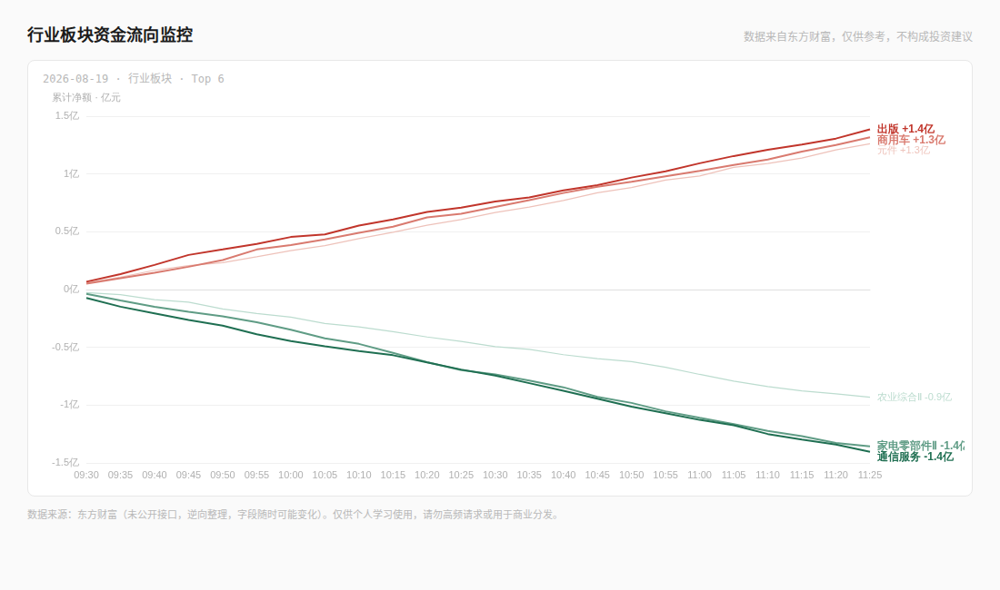

# 板块资金流向监控（东方财富 + 开盘啦）

一个 Django + React 单仓库应用，用于采集、保存并展示 A 股交易日内的板块资金流快照。系统提供两套**彼此独立**的数据源，并在前端通过标签页切换：

- **东方财富**：仅三级行业，使用 `fs=m:90+s:8+f:!50`。
- **开盘啦**：开盘啦 App `ZhiShuRanking.RealRankingInfo` 返回的行业/概念混合板块。

两套数据源分别拥有模型、SQLite 数据库、抓取命令、服务层、API 和前端请求 hook；共享 Django/DRF、A 股交易日与 15 分钟时间轴规则，以及图表、排行榜展示组件。默认展示东方财富数据。

> 数据仅供个人学习和参考，不构成投资建议。两个上游接口均非面向本项目的稳定公开服务；请避免高频请求、绕过访问控制或进行商业分发。



## 当前功能

- 在 A 股交易时段内，将采集时间向下对齐到 15 分钟刻度并保存快照。
- 图表使用固定的 18 个交易刻度，午休从 `11:30` 直接跳到 `13:00`。
- 每个数据源的当日分时接口分别返回资金流入与流出的 Top N 曲线；前端每侧请求 25 条、默认勾选每侧前 5 条，并允许手动增减。
- 同一交易日内保留用户的复选框选择；切换到新的交易日才恢复默认选择。
- 图表和排行榜拥有加载、空数据、请求失败、数据可能过期（`stale`）和响应式布局状态。
- 不使用浏览器结果缓存或自动轮询；服务端按交易刻度和数据版本缓存聚合结果，写入成功后才失效对应交易日的缓存。

## 数据源与抓取规则

### 东方财富：三级行业双榜

- 请求端点：`https://push2.eastmoney.com/api/qt/clist/get`。
- 固定筛选和参数：`fs=m:90+s:8+f:!50`、`ut=8dec03ba335b81bf4ebdf7b29ec27d15`、`fid=f62`、`pn=1`、`pz=50`。
- 每次抓取按顺序请求两份独立排行榜：
  1. `po=1`：主力净流入 Top 50；
  2. `po=0`：主力净流出 Top 50。
- 首个榜单成功后，在请求流出榜前**精确等待 120 秒**；没有额外的请求后冷却。
- 首次 HTTP 请求前生成整个间隔计划：两个榜单各最多 5 次重试，共 10 个互不相同且不少于 45 秒的重试间隔；加上 120 秒跨榜单间隔，计划总和不超过 700 秒。抓取使用 889 秒的单调时钟截止时间，若无法完整等待规定间隔则停止，而不会缩短间隔。
- 传输连接失败后会重建自有 HTTP session。每个方向失败仍保留另一方向；仅当两个方向都没有有效数据时不写入快照。
- 两榜按 `sector_code` 合并；后请求的流出榜同代码记录覆盖先前流入榜记录，因为它更新更晚。

### 开盘啦：全量分页板块排行

- 请求端点：`https://apphwshhq.longhuvip.com/w1/api/index.php`，使用表单 POST，动作 `c=ZhiShuRanking&a=RealRankingInfo`。
- 以 `Index` 从 0 开始、每页 `st=30` 串行分页，达到上游 `Count` 后停止；按板块代码去重。
- 每一页最多尝试 3 次；前两次失败后固定等待 1.5 秒。任一页最终失败、响应 `errcode` 非 `0` 或未得到有效记录时，本次抓取不写入快照。
- 如配置凭据，只能从环境变量读取：`KPL_USER_ID`、`KPL_TOKEN`、`KPL_DEVICE_ID`。当前请求仅在 `KPL_USER_ID`/`KPL_TOKEN` 非空时附带二者，不把缺失作为前置失败；上游允许匿名访问的现状并非稳定契约。不得将 token、设备标识或抓包内容写进代码、文档、测试数据或日志。
- 开盘啦保存上游实际提供的字段：涨跌幅、主力净额/买/卖、300 万以上大单净额、量比、成交额、流通市值和总市值。它不提供东方财富的板块指数、主力净占比、超大/大/中/小单拆分，系统不会伪造这些字段。

## 时间、持久化与过期数据

### 交易时间

交易日通过 `chinese-calendar` 判断，且始终排除周六、周日；交易所临时停市等非日历例外需要另行维护。项目时区为 `Asia/Shanghai`。

每天的离散交易刻度为：

```text
09:30  09:45  10:00  10:15  10:30  10:45  11:00  11:15  11:30
13:00  13:15  13:30  13:45  14:00  14:15  14:30  14:45  15:00
```

正常抓取只在 `09:30–11:30` 和 `13:00–15:00` 运行，并向下对齐当前时间，例如 `09:35 → 09:30`、`10:10 → 10:00`。`--latest` 只在非交易时段生效：优先依据上游行情时间推断最近合法刻度，缺少有效上游时间时回退到最近收盘刻度。

### 独立持久化

| 数据源 | Django app | 开发数据库 | 快照状态 |
| --- | --- | --- | --- |
| 东方财富 | `fundflow` | `backend/db.sqlite3`（默认库） | 每个刻度记录流入榜、流出榜是否成功 |
| 开盘啦 | `kaipanla` | `backend/kaipanla.sqlite3`（由 `KaipanlaRouter` 路由） | 每个刻度记录单次全量分页抓取是否成功 |

两套快照都以 `(sector_code, snapshot_time)` 唯一约束进行 upsert，因此重跑同一刻度可以修复已有记录。状态与快照在同一个事务中写入，且仅在成功提交后失效服务端缓存。

### 分时排行与 `stale`

分时 API 的 `main_net_inflow` 单位为元，响应和图表将其转换为亿元；单条曲线在已到达的离散刻度上以前值前向填充。

- 东方财富的流入、流出候选分别从当前刻度对应的成功榜单选择；若该方向不可用，则只回退到**紧邻的前一个**交易刻度。历史快照只能补全已选行业的曲线，不能把早先榜单中的行业带入当前排行。
- 开盘啦是单次全量排行：从当前刻度向前寻找最近一个有数据且未标记失败的快照作为排行来源。
- 到达时间轴中缺少快照、当前抓取状态不完整，或发生候选来源回退时，接口返回 `stale: true`。前端显示“数据可能不是最新”。

## HTTP API

Django 路由在 `backend/config/urls.py` 中定义。所有端点均返回 JSON；当前实现没有 API 身份验证，应仅部署在受控网络或在反向代理层增加访问控制。

### 公共查询参数

- `date`：可选 ISO 日期（例如 `2026-09-03`）。省略或格式无效时，使用该数据源数据库内最近的交易日；若库为空则使用当前本地日期。
- `inflow_top`、`outflow_top`：仅分时端点使用，默认各为 `5`，允许 `0`，服务端限制在 `0–30`。

### 东方财富

| 方法 | 路径 | 说明 |
| --- | --- | --- |
| `GET` | `/eastmoney-api/sectors/` | 指定交易日最后一个快照的三级行业列表，返回 `[{"code", "name"}]`。 |
| `GET` | `/eastmoney-api/sectors/intraday/` | 三级行业当日累计主力净流入的分时曲线与排行。 |

示例：

```bash
curl 'http://localhost:8000/eastmoney-api/sectors/intraday/?date=2026-09-03&inflow_top=25&outflow_top=25'
```

### 开盘啦

| 方法 | 路径 | 说明 |
| --- | --- | --- |
| `GET` | `/kaipanla-api/sectors/` | 指定交易日最后一个快照的开盘啦板块列表，返回 `[{"code", "name"}]`。 |
| `GET` | `/kaipanla-api/sectors/intraday/` | 开盘啦板块当日累计主力净流入的分时曲线与排行。 |

示例：

```bash
curl 'http://localhost:8000/kaipanla-api/sectors/intraday/?date=2026-09-03&inflow_top=25&outflow_top=25'
```

分时响应结构相同：

```json
{
  "trade_date": "2026-09-03",
  "time_points": ["09:30", "09:45"],
  "series": [
    {
      "code": "BKxxxx",
      "name": "示例板块",
      "latest_net_inflow": 1.2345,
      "data": [0.9, 1.2345]
    }
  ],
  "stale": false
}
```

历史日期返回完整 18 个 `time_points`；当日只返回当前时刻已经到达的刻度。前端仍始终渲染完整的 18 格横轴，并将未来位置保持为空。

## 项目结构

```text
backend/
├── config/                              # Django 设置、路由、CORS、缓存、ASGI/WSGI
├── fundflow/                            # 东方财富三级行业 app
│   ├── management/commands/fetch_sector_fund_flow.py
│   ├── services/eastmoney/              # 请求常量、计划、HTTP、解析、双榜编排
│   ├── services/snapshot_*.py           # 时间决定、抓取收集、事务写入
│   ├── services/sector_intraday_*.py    # 查询、构建、缓存和用例协调
│   ├── models.py / views.py / urls.py
│   └── tests.py
└── kaipanla/                            # 开盘啦独立 app
    ├── db_router.py
    ├── management/commands/fetch_kaipanla_sector_fund_flow.py
    ├── services/                        # POST、分页、解析、快照、分时查询/缓存
    ├── models.py / views.py / urls.py
    └── tests.py
frontend/src/
├── api/client.js                        # Axios 与四个后端 API 封装
├── components/                          # ECharts 曲线图、可勾选排行榜
├── features/sector-flow/                # 东方财富页面、hooks 和纯序列 helper
├── features/kaipanla-flow/              # 开盘啦页面、hooks 和纯序列 helper
├── App.jsx                              # 数据源 tab 切换
└── index.css                            # 全局与响应式样式
docs/preview_intraday.png                # 界面预览
```

## 本地开发

### 1. 配置环境变量

复制环境变量模板。当前开盘啦板块排行命令不强制 `KPL_*` 存在；如需为上游行为变化或其他获授权的 App 接口配置凭据，再填写并注入这些变量。东方财富不依赖它们。

```bash
cp .env.example .env
```

Django 目前直接通过进程环境读取 `KPL_*`，不会自动加载 `.env`。只有需要向请求附带可选 App 凭据时，才将变量安全地导出到 shell，或通过进程管理工具注入。前端可选配置：

```bash
VITE_API_BASE=http://localhost:8000
```

`VITE_API_BASE` 只填写协议和主机，不要包含 `/eastmoney-api/` 或 `/kaipanla-api/` 前缀。

### 2. 启动后端

从 `backend/` 目录执行：

```bash
python -m venv venv
source venv/bin/activate
pip install -r requirements.txt
python manage.py migrate
python manage.py migrate --database=kaipanla
python manage.py runserver 8000
```

默认的 `migrate` 只处理东方财富所在的默认数据库；首次初始化和迁移开盘啦独立库时，还必须执行 `python manage.py migrate --database=kaipanla`。

### 3. 抓取快照

仍在 `backend/` 目录：

```bash
# 东方财富：交易时段内采集；非交易时段默认退出
python manage.py fetch_sector_fund_flow

# 开盘啦：交易时段内采集；KPL_* 存在时会随请求发送，但当前实现不强制
python manage.py fetch_kaipanla_sector_fund_flow

# 非交易时段抓取上游最近可用快照
python manage.py fetch_sector_fund_flow --latest
python manage.py fetch_kaipanla_sector_fund_flow --latest

# 执行真实请求、打印前五条结果，但不写数据库
python manage.py fetch_sector_fund_flow --dry-run
python manage.py fetch_kaipanla_sector_fund_flow --dry-run
```

`--latest` 在交易时段内不会改变正常采集语义。不存在 `--force`；不要依赖参数缩写。

### 4. 启动前端

从 `frontend/` 目录执行：

```bash
npm install
npm run dev
```

Vite 默认在 `http://localhost:5173` 启动；当前 Django CORS 配置允许该地址及 `http://127.0.0.1:5173` 访问本地 API。

## 验证命令

```bash
# backend/
python manage.py test fundflow kaipanla
python manage.py check
python manage.py makemigrations --check --dry-run

# frontend/
npm run lint
npm run build

# 仓库根目录
git diff --check
```

单元测试必须 mock 网络调用和 sleep。若确实需要验证上游接口，请显式执行一次最小、只读的检查；将限流、网络抖动与确定性的实现错误区分开。当前 Vite 的大 bundle 提示是已知警告，不等于构建失败。

## 部署与运行注意事项

- 开发配置使用 SQLite 和 `FileBasedCache`，让本机的 Web 进程和管理命令共享缓存目录。多 worker 或多主机生产环境必须替换为共享的 Redis 兼容缓存，并审视 SQLite 是否满足并发/备份要求。
- 生产环境必须替换开发设置：关闭 `DEBUG`、配置安全的 `SECRET_KEY` 与 `ALLOWED_HOSTS`、把 CORS 白名单收紧为实际前端域名，并在公开暴露 API 前增加认证/网络访问控制。
- 两个采集命令可能持续数分钟。调度时为每个命令使用互斥锁（例如 `flock`），避免重叠执行和对上游造成不必要压力。
- 不要提交 `.env`、凭据、抓包数据、本地 SQLite 文件、日志、缓存目录、虚拟环境、`node_modules` 或前端构建产物。
